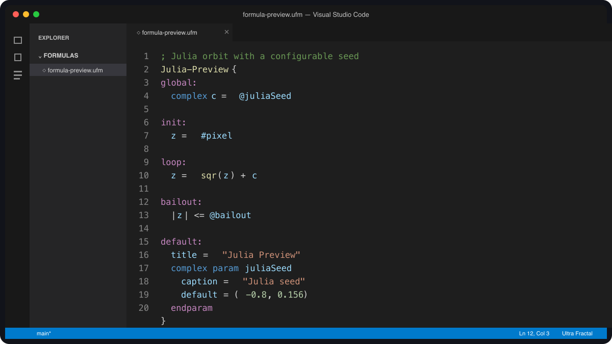
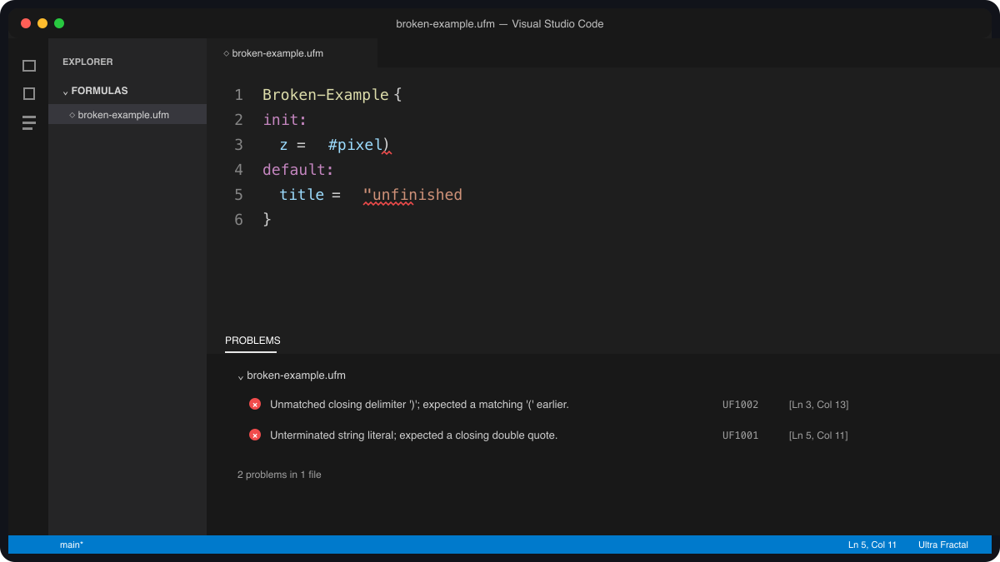

# Ultra Fractal Language Support

Opening a large Ultra Fractal formula as plain text is a miserable way to work.
Sections run together, comments look like code, and finding one formula in a
long file means a lot of scrolling.

This extension teaches VS Code how Ultra Fractal source files are put together.
It adds color, folding, an Outline, a few writing shortcuts, and checks for
common structural mistakes. You still use Ultra Fractal to compile and run the
formula.



## Start here

Once you have installed the extension, open one of your formula files in VS
Code. There is no project to create and no setup wizard. The language name in
the lower-right corner of the window should say **Ultra Fractal**.

You can then use VS Code as you normally would:

- Comments, strings, numbers, parameters, sections, and functions have
  different colors.
- The small arrows beside the line numbers fold long sections out of the way.
- The Outline panel gives you a quick list of formulas, classes, sections, and
  functions in the current file.
- VS Code points out some broken strings, brackets, blocks, and declarations as
  you type.

The extension recognizes these files:

| File ending | What Ultra Fractal stores there |
| --- | --- |
| `.ufm` | Fractal formulas |
| `.ucl` | Coloring algorithms |
| `.uxf` | Transformations |
| `.ulb` | Classes and plug-in libraries |

Ultra Fractal parameter sets (`.upr`) use a different format, so this extension
leaves them alone. It also leaves ordinary `.txt` files alone.

## Installing the extension

### Install from VSIX

A VSIX is an installable VS Code extension file. To install one:

1. Download `ultra-fractal-language-0.1.0.vsix` from the matching GitHub
   release.
2. Open the Extensions view in VS Code. Its icon looks like four small blocks.
3. Open the **Views and More Actions** menu at the top of that view.
4. Choose **Install from VSIX...**, select the downloaded file, and reload VS
   Code if it asks you to.

If you are comfortable with a terminal, the same installation takes one
command:

```sh
code --install-extension ultra-fractal-language-0.1.0.vsix
```

Marketplace and Open VSX links will be added after the first registry release.

## Reading and moving around a formula file

### Colorization

The extension uses the colors from your current VS Code theme. It does not
force a special color scheme on you. Dark themes, light themes, and custom
themes can all choose their own shades for comments, strings, numbers, types,
and the rest of the language.

Colorization is useful even if you turn the checks off. A line such as
`|z| <= @bailout` may use a quiet or pale color in some themes; that is normal.
The exact shade comes from the theme, not from this extension.

### Folding and the Outline

Formula libraries get long. You can fold a whole formula, class, section,
function, parameter block, or `comment { ... }` documentation block and keep
the part you are editing on screen.

Open VS Code's Outline view when you want the larger picture. It lists the
entries in source order and nests sections and functions beneath their parent
formula or class. Selecting an item takes you to that part of the file.

### Imports

For an import such as `import "common.ulb"`, the quoted filename becomes a
link when the extension can find the file. Follow the link or use **Go to
Definition** to open it.

The extension first looks beside the file you are editing. It then checks your
open workspace and any extra formula folders you have listed in the settings.
See [If an import cannot be found](#if-an-import-cannot-be-found) below.

## Writing formulas

The editor understands semicolon comments, matching brackets, and quoted
strings. The usual VS Code commands work: toggle a line comment, surround a
selection with quotes, or press Enter after a section heading to get a useful
indent.

Seven starter snippets are included. Type `uf-` in an Ultra Fractal file and
pick one from the suggestion list. There are templates for a fractal formula,
coloring algorithm, transformation, class, parameter, function, and
conditional block. Each template has tab stops so you can move through the
parts that need names or values.

The extension does not reformat old files. It only adjusts indentation on the
line you are typing.

## About the checks

As you edit, the extension looks for mistakes that it can identify without
guessing. It catches things such as an unfinished string, a closing bracket
with no matching opener, a block that never ends, or two definitions with the
same name. Problems appear as squiggly underlines and in VS Code's Problems
panel.

Each message has a short identifier such as `UF1001`. The identifier stays the
same even if the wording changes, which makes it useful in settings and bug
reports. The [diagnostic rule reference](docs/diagnostics.md) explains every
identifier.



Run **Ultra Fractal: Validate Current File** from the Command Palette whenever
you want a fresh check. Most of the time you can leave this alone; the extension
also checks after you pause while editing and when you save.

### Validation limits

The analyzer does not compile or run formulas. It does not know every type,
function overload, inherited class member, or runtime rule that Ultra Fractal
knows. Ultra Fractal remains the authority on whether a formula compiles and
what it does when it runs.

In practical terms, an empty Problems panel means that the extension found no
structural mistake. It does not promise that Ultra Fractal will accept the
formula. Treat these messages as an early warning system, then use Ultra
Fractal's Compiler Messages window for the final answer.

Some warnings cover old syntax that may still be intentional. You can change
the level of an individual rule, or turn that rule off, without disabling the
rest of the checks.

## If an import cannot be found

Ultra Fractal knows where you keep its formula collections. VS Code does not,
so the extension needs a little help when an imported file lives outside your
workspace.

Open VS Code Settings, search for `Ultra Fractal formula search paths`, and add
the folders that contain your `.ufm`, `.ucl`, `.uxf`, or `.ulb` files. Relative
folder names start from the open workspace. Full paths can point anywhere on
your computer.

A missing-import message is trustworthy only when this list covers all the
places where you keep formulas.

## Settings

Most users can keep the defaults. To change them, open VS Code Settings and
search for `Ultra Fractal`.

### Turn the checks on or off

The `ultraFractal.lint.enabled` setting turns the structural checks on or off.
Colorization, folding, the Outline, snippets, and import links continue to work
when checks are off. The default is `true`.

### Change how soon a check starts

The `ultraFractal.lint.debounceMilliseconds` setting controls how long the
extension waits after a keystroke before checking the file. The default is 300
milliseconds. You can choose a value from 0 to 5000.

### Limit the number of messages

The `ultraFractal.lint.maxDiagnostics` setting limits how many messages the
extension shows for one file. The default is 100, and the allowed range is 1 to
1000. A limit keeps one badly broken file from filling the Problems panel with
hundreds of follow-on errors.

### Change or hide a rule

The `ultraFractal.lint.severityOverrides` setting changes the level of a rule
by its `UF` identifier. A rule can appear as an error, warning, information, or
hint, or you can set it to `off`.

### Add formula folders

The `ultraFractal.formulaSearchPaths` setting lists extra folders where the
extension should look for imported formula files. The default list is empty.

<details>
<summary>Example settings for advanced users</summary>

This example hides the legacy-syntax warning `UF2004` and adds two import
folders:

```json
{
  "ultraFractal.lint.severityOverrides": {
    "UF2004": "off"
  },
  "ultraFractal.formulaSearchPaths": [
    "formulas",
    "/path/to/shared/formulas"
  ]
}
```

</details>

## Reporting problems

Please use the [GitHub issue tracker](https://github.com/simenkva/ultra_fractal_tools/issues)
if something is colored strangely, a valid formula gets a warning, or the
extension misses an obvious mistake.

A useful report includes the extension version, your VS Code version, the file
ending, and the `UF` identifier if a diagnostic is involved. A small formula
that reproduces the problem helps more than a screenshot alone. Remove private
code and any third-party formula code that you do not have permission to share.
The longer checklist is in [SUPPORT.md](SUPPORT.md).

The extension collects no telemetry and makes no network requests. It reads the
files you open and the local folders needed to resolve imports. See
[PRIVACY.md](PRIVACY.md) for the full statement.

## Working on the extension itself

You do not need anything in this section to edit Ultra Fractal formulas. These
commands are for people who want to change or test the extension:

```sh
npm ci
npm test
npm run test:integration
npm run package:contents
npm run package:vsix
```

Press F5 in VS Code and choose **Run Ultra Fractal Extension** to open a test
window.

The project can also check a separately downloaded formula collection:

```sh
npm run corpus:verify
npm run benchmark:analyzer
npm run benchmark:grammar
```

The repository does not include that collection or the Ultra Fractal manual.
Both stay outside Git and outside the extension package. The
[corpus review](docs/corpus-validation.md),
[performance notes](docs/performance.md), and
[release checklist](docs/releasing.md) describe the maintenance process.

The UF6 language catalog lives in `src/catalog/uf6.ts`. Notes about its sources
and old syntax live in `docs/language-catalog.md` and
`docs/legacy-syntax.md`.

## About this project

Ultra Fractal is a product of Frederik Slijkerman. This independent extension
is not affiliated with or endorsed by Ultra Fractal. The project used OpenAI
Codex during development.

Simen Kvaal licenses the extension under the [MIT License](LICENSE).
