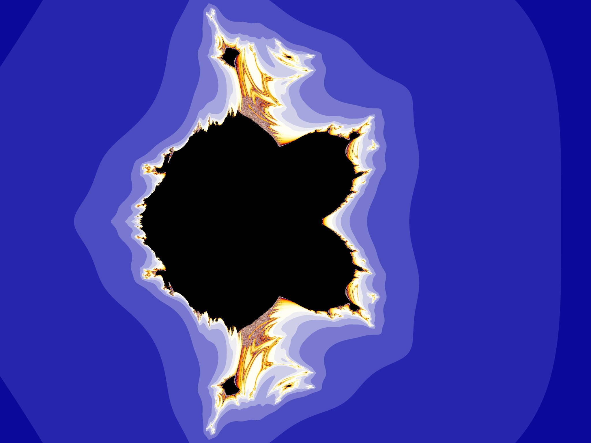
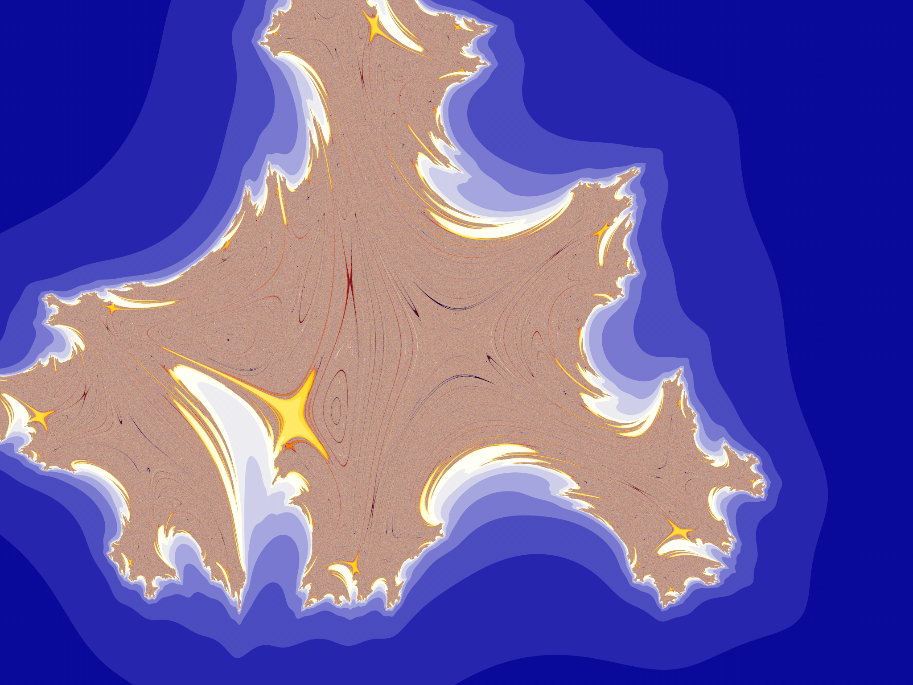
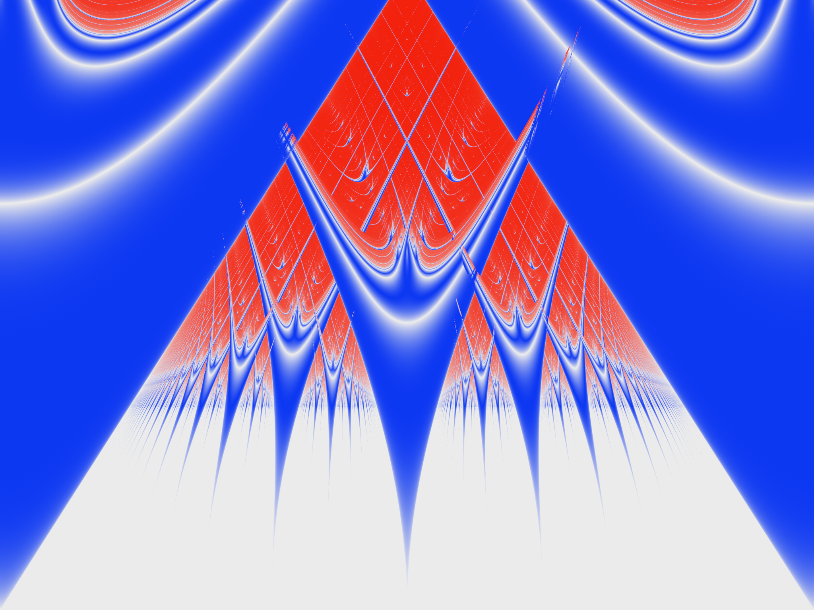

# Example using the  Develop Ultra Fractal Formula skill

In this folder, the results of a simple example session in VSCode using the Develop Ultra Fractal Formula skill is showcased. This was done using the GPT-5.6 Sol model.

## Prompt 1

> `$develop-ultra-fractal-formulas` Develop a parameterized Ultra Fractal formula that interpolates between the p-power Mandelbrot formulas, i.e., the iteration $z \mapsto z^p + c$. For integer $p$, this is an analytic map. For non-integer $p$ it is not analytic. However, it should be possible to create smooth *real* maps $(x,y) \mapsto f(x,y;p)$, such that for integer $p$, we have $f(x,y;p)$ = $(Re z^p+c, Im z^p+c)$ with $z=x+iy$. Write the formula in a new file.

## Response:

Created [`smooth_real_power_mandelbrot.ufm`](smooth_real_power_mandelbrot.ufm)

It implements

$$
F_p(z)=(1-s)z^n+s z^{n+1}
+a\,s(1-s)\overline{z^n},
\qquad n=\lfloor p\rfloor,
$$

using a $C^\infty$, endpoint-flat blend $s$. Thus:

- Integer $p$: exactly $z\mapsto z^p+c$.
- Noninteger $p$: a smooth real map, non-holomorphic when “Non-analytic bridge” is nonzero.
- Setting the bridge to zero gives the purely holomorphic polynomial interpolation.
- Image-wide interpolation values are calculated once in `global:`, following [UF6 global-section semantics](https://www.ultrafractal.com/help/writing/formulas/globalsections.html).

Target: Ultra Fractal 6  
Structural check: passed — 0 errors, 0 warnings  
UF6 compilation: not tested  
Render check: not supplied  
Evidence used: official, repository-verified, design inference  
Remaining uncertainties: UF6 compiler acceptance and rendered behavior still require testing in Ultra Fractal 6.  
Next test: reload the file in UF6; render at $p=2$, $2.5$, and $3$, then animate through $p=3$ to verify visual smoothness.

## Comment

This resulted in the file [`smooth_real_power_mandelbrot.ufm`](smooth_real_power_mandelbrot.ufm), containing a formula `SmoothRealPowerMandelbrot`. Inspection shows that the Ultra Fractal formula code is excellently written. Here is an example render, with the power $p=2.5$:

## Prompt 2

> Add a julia-type version in the same file, including switching support.
>

## Response

Updated [`smooth_real_power_mandelbrot.ufm`](smooth_real_power_mandelbrot.ufm).

Added:

- `SmoothRealPowerJulia`, iterating from `z = #pixel` with constant `@seed`.
- Mandelbrot → Julia switching, using the selected point as the Julia seed.
- Julia → Mandelbrot switching.
- Bidirectional forwarding of `power`, `bridgeStrength`, and `bailout`, following UF6’s documented [switch convention](https://www.ultrafractal.com/help/writing/formulas/switchfeature.html).

Target: Ultra Fractal 6  
Structural check: passed — 0 errors, 0 warnings  
UF6 compilation: not tested  
Render check: not supplied  
Evidence used: official, repository-verified, design inference  
Remaining uncertainties: Switch behavior and compilation require confirmation in UF6.  
Next test: reload the file, enter Switch Mode on the Mandelbrot entry, select a point, and confirm the Julia preview receives the seed and shared parameters.

## Comment

This resulted in the file [`smooth_real_power_mandelbrot.ufm`](smooth_real_power_mandelbrot.ufm) being updated with an additional formula, `SmoothRealPowerJulia`. As I wanted, the formulas support switching.

Here is a Julia set corresponding to $c = (-0.3857142857, 0.9857142857)$, just on the border of the filled and unfilled part of the Mandelbrot set above:

## Prompt 3

> The circle map is a two-parameter dynamical system that has stable parameter regions and chaotic regions. Research this map, and implement an ultra fractal formula for calculating the lyapunov exponent.

## Response

Implemented the circle-map Lyapunov parameter plane with companion signed coloring:

- [`circle_map_lyapunov.ufm`](circle_map_lyapunov.ufm)
- [`circle_map_lyapunov.ucl`](circle_map_lyapunov.ucl)

The formula uses

$$
\theta_{n+1}=\theta_n+\Omega-\frac{K}{2\pi}\sin(2\pi\theta_n)\pmod 1
$$

with the parameter-plane coordinates $\Omega=\operatorname{Re}(\#pixel)$ and $K=\operatorname{Im}(\#pixel)$. It calculates

$$
\lambda_N=\frac1N\sum_n\log\left|1-K\cos(2\pi\theta_n)\right|
$$

after discarding a configurable transient.

Research basis:

- For $K<1$, the map is monotone and invertible; $K=1$ is critical; for $K>1$, it becomes noninvertible and chaotic regions can occur.
- Typical attracting periodic orbits have $\lambda<0$, quasiperiodic motion has $\lambda\approx0$, and chaotic trajectories have $\lambda>0$.
- Multistability can make the result depend on the initial phase, so that is exposed as a parameter.

These properties follow the classic circle-map analysis by [Jensen, Bak, and Bohr](https://doi.org/10.1103/PhysRevA.30.1960), the two-parameter Lyapunov diagrams of [Bastos de Figueiredo and Malta](https://doi.org/10.1142/S0218127498000176), and the Lyapunov formulation discussed by [Mugnaine et al.](https://doi.org/10.1103/PhysRevE.106.034203).

The coloring uses blue for negative exponents, light gray near zero, and red for positive exponents. `periodicity = 0` prevents Ultra Fractal from terminating an orbit during the discarded transient.

| Parameter | Default | Purpose |
|---|---:|---|
| Initial phase | 0.314159… | Selects the sampled orbit or basin |
| Discarded transient | 500 | Removes initial convergence |
| Derivative floor | $10^{-30}$ | Handles an exactly zero derivative |
| Zero tolerance | 0.002 | Neutral finite-time band |
| Exponent contrast | 6 | Controls color saturation |

Target: Ultra Fractal 6

Structural check: Passed for both files with zero errors and zero warnings.

UF6 compilation: Not yet run in the native compiler.

Render check: Not yet run.

Evidence used: Primary circle-map papers, official UF6 formula/direct-coloring documentation, structural analysis, and independent numerical recurrence tests.

Remaining uncertainties: Native UF6 compiler acceptance and final rendered appearance. Finite-time boundaries may also move when Maximum Iterations, transient length, or initial phase changes.

Next test: Refresh formulas in UF6, select `CircleMapLyapunov`, set `CircleMapLyapunovDirect` as the Inside coloring, and ensure Maximum Iterations remains greater than the discarded transient. The numerical smoke tests gave $0$, $-0.693147$, and $+0.365802$ for neutral, attracting, and chaotic examples respectively.

## Comment

This resulted in the files [`circle_map_lyapunov.ufm`](circle_map_lyapunov.ufm) and [`circle_map_lyapunov.ucl`](circle_map_lyapunov.ucl). Below is a render using the formula `CircleMapLyapunov` and the coloring algorithm `CircleMapLyapunovDirect`.

## Prompt 4

> Can you use (maybe) `$academic-research-suite` and `$develop-ultra-fractal-formulas` and `$humanize-writing`, and write a markdown report of your development of the Mandelbrog and Circle map fractals? I want to publish these as examples of the `$develop-ultra-fractal-formulas` in action. I can supply PNG images of rendered fractals for the report.

Codex wrote one Markdown file that I was not entirely happy with. I wanted two files, one for each formula created.

> I would rather you write 2 blog-post style articles. Make sure it is transparent for the ultra fractal user, that is not necessarily an expert on AI or Codex use. You should assume they are not completely ignorant either.
>
>

The resulting files are [`smooth-real-power-mandelbrot-blog.md`](smooth-real-power-mandelbrot-blog.md) and [`circle-map-lyapunov-blog.md`](circle-map-lyapunov-blog.md). The images were created by me in Ultra Fractal using the Codex-generated formulas, and inserted by hand.

